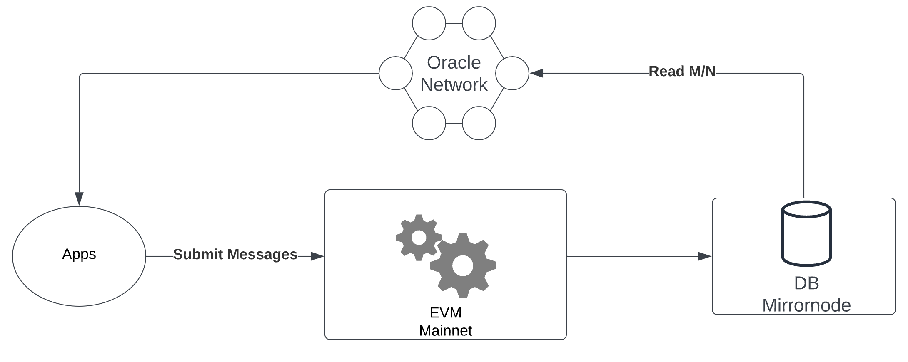

## Abstract

Enable Smart Contracts and Hedera Consensus Services to interoperate by having an oracle network talk to both services. Doing this will allow contracts to create, read, and write to HCS topics via the proxied oracle network.

## Motivation

Interoperability between the HCS and smart contracts via oracle network proxy would enable developers to leverage HCS-stored data in their dApps.

## Rationale

1. By enabling smart contracts to interact with the HCS via an oracle network proxy, we allow the creation of HCS-based Oracles. For example, an oracle network can talk to a smart contract and also subscribe to a private or public topic in order to read its external data, such as the prices of crypto-assets and give it to the smart contract.

2. This would also enable topic-based NFT minting rights. An oracle network could ingest an HCS topic and communicate the result to smart contracts in order to calculate the user's available NFTs. Then, after minting the NFT and transferring it to the user, the smart contract could update that same HCS topic. Currently, this process is only achievable via a centralized, server-based chain of events (such as on [https://hashandslash.io](hashandslash.io)).

3. Any other Oracle use case could be repurposed by HCS.

## User stories

As a developer, I want to use a distributed oracle network to read data from HCS topics and send it to my smart contract.

As a developer, I want to use a distributed oracle network triggered by my smart contract to write to or create HCS topics.

## Specification

## Security Implications

With regards to signing transactions from within a smart contract, the main concern is storing private keys in-state. So, some possible solutions are:

1. Give a different kind of permission to deployed smart contracts for interacting with certain topics. This could function similarly to how AWS differentiates between key-based permissions and role-based permissions.
2. Follow the same approach from the [https://hips.hedera.com/hip/hip-206](HTS pre-compiled contracts HIP) to signing transactions and interacting with topics.

## Rejected Ideas

1. Enable smart contracts to directly interact with HCS topics by following the same approach as the [https://hips.hedera.com/hip/hip-206](HTS pre-compiled contracts HIP). This is not possible since EVM execution must be deterministic. This requires EVM execution to be based on the provable onchain state and signed transactions so there is no way smart contracts can directly call HCS to write to topics.

2. Directly reading topics from smart contracts. Although, this is possible, in order to maintain consitency among these kinds of transactions, it is better to read and write through the oracle network.

## References

https://hedera.com/blog/use-cases-for-hcs-based-records-in-play-to-earn-nft-gaming

https://hashandslash.io

## Copyright/license

This document is licensed under the Apache License, Version 2.0 -- see [LICENSE](../LICENSE) or (https://www.apache.org/licenses/LICENSE-2.0)
